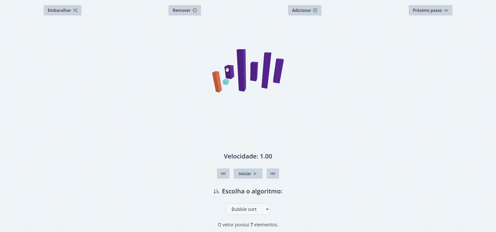

# 3D Sort

<div align="center">



A 3D sorting algorithm Progressive Web App (PWA).

[**Try it out »**](https://3dsort.marcelo-schreiber.com/)

[Getting Started](#getting-started) · [Report Bug](https://github.com/marcelo-schreiber/3d-sort/issues) · [Request Feature](https://github.com/marcelo-schreiber/3d-sort/issues)

</div>

## Table of Contents

1. [About The Project](#about-the-project)
   - [Built With](#built-with)
2. [Getting Started](#getting-started)
3. [How to Test](#how-to-test)
   - [Running Tests](#running-tests)
   - [Test Coverage](#test-coverage)
4. [Contributing](#contributing)
5. [Contact](#contact)

## About The Project

[](https://github.com/marcelo-schreiber/3d-sort/blob/main/LICENSE)

[](https://app.netlify.com/projects/3dsort/deploys)

This project helps users understand how sorting algorithms work in a visual and interactive way. It supports offline usage thanks to PWA technology and lets users control the speed of animations to match their learning pace.

## Features

- Offline and app support (PWA)
- Choose from multiple sorting algorithms
- Adjustable animation speed
- Mobile responsive

## Algorithms Implemented

- Bubble Sort
- Selection Sort
- Insertion Sort
- Merge Sort
- Quick Sort
- Heap Sort

### Built With

- [React](https://reactjs.org/)
- [TypeScript](https://www.typescriptlang.org/)
- [Three.js](https://threejs.org/)
- [@react-three/fiber](https://docs.pmnd.rs/react-three-fiber/getting-started/introduction) by [Poimandres](https://github.com/pmndrs)
- [Vite](https://vitejs.dev/)
- [Vite PWA Plugin](https://vite-pwa-org.netlify.app/)
- [React Icons](https://react-icons.github.io/react-icons/)

## Getting Started

### `yarn`

Installs all necessary dependencies.

### `yarn dev`

Starts the app in development mode.

The page will automatically reload if you make edits.

## How to Test

This project includes a comprehensive test suite with 82+ tests covering sorting algorithm correctness, edge cases, and visualization data validation.

### Running Tests

```bash
# Run tests in watch mode (interactive)
npm run test

# Run tests once and exit
npm run test:run

# Run tests with UI (browser-based test runner)
npm run test:ui
```

### Test Coverage

The test suite includes:

#### **Sorting Algorithm Tests (48 tests)**

- **Correctness validation** for all 6 algorithms
- **Edge cases**: empty arrays, single elements, sorted/reverse sorted data, duplicates, negative numbers
- **Generator behavior**: ensures proper step-by-step data for 3D visualization

#### **Utility Function Tests (15 tests)**

- `findMaxValue`: maximum value detection
- `shuffle`: array randomization with element preservation

#### **Visualization Data Tests (4 tests)**

- Array length consistency throughout sorting
- Element preservation (no data loss)
- Valid index bounds checking
- Proper animation state indicators

#### **Advanced Edge Cases (6 tests)**

- Large arrays (100+ elements)
- Extreme values (MAX_SAFE_INTEGER/MIN_SAFE_INTEGER)
- Floating-point number handling
- Two-element arrays
- Arrays with identical elements

## Contributing

Contributions make the open source community amazing. Any contributions you make are **greatly appreciated**.

1. Fork the repository
2. Create your feature branch (`git checkout -b feature`)
3. Commit your changes (`git commit -m 'Add new feature'`)
4. Push to the branch (`git push origin feature`)
5. Open a Pull Request

## Contact

- Discord: Losaeg#1619  
- Email: <marcelorissette15@gmail.com>  
- Project Link: [https://github.com/marcelo-schreiber/3d-sort](https://github.com/marcelo-schreiber/3d-sort)

### Made with <3 by Marcelo Schreiber
